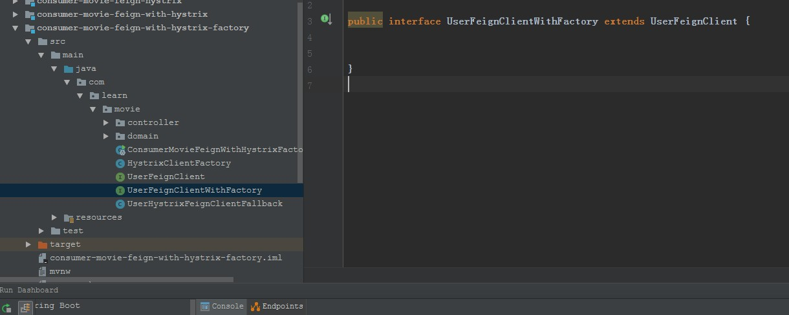
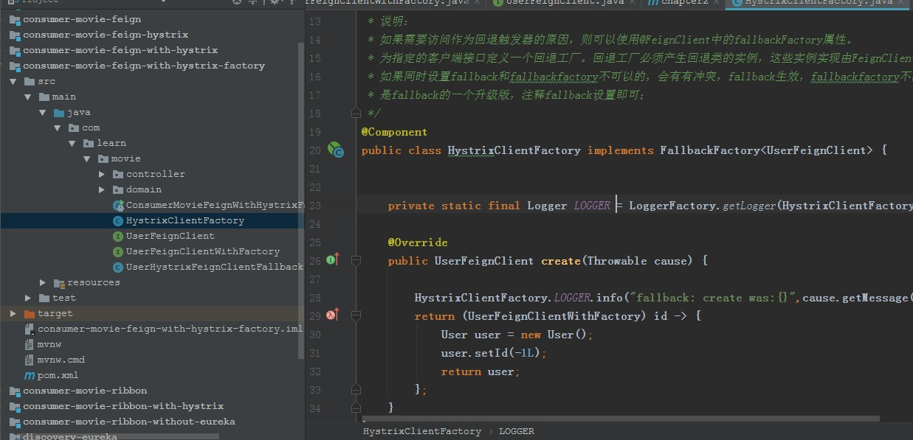
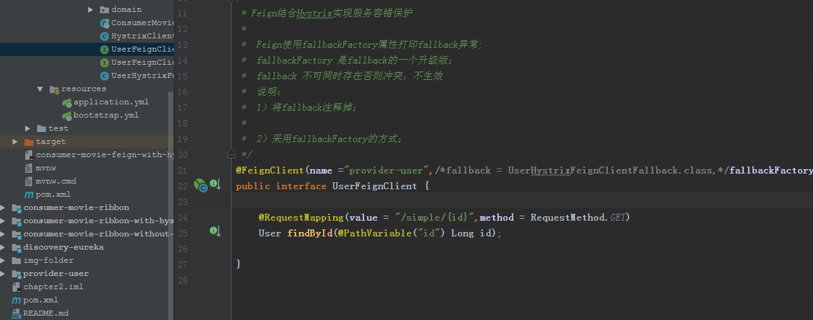

**Hystrix微服务的容错处理**
-------------------------
   

服务提供者在调用服务消费时，如果服务提供者响应非常缓慢，那么消费者对提供者的请求会被强制等待，直到提供者响应或者
HTTP请求超时。在高负载的情况下，如果不作任何处理，此类问题可能会导致服务消费者的资源耗尽甚至出现雪崩效应。

如果下图所示：A作为服务提供者，B为A的服务消费者，C和D是B的服务消费者。A不可用引起了B的不可用，并将不可用像滚雪球
一样放大到C和D时，雪崩效应就形成了。

熔断器（CircuitBreaker）

    熔断器的原理很简单，如同电力过载保护器。它可以实现快速失败，如果它在一段时间内侦测到许多类似的错误，会强迫其
    以后的多个调用快速失败，不再访问远程服务器，从而防止应用程序不断地尝试执行可能会失败的操作，使得应用程序继续
    执行而不用等待修正错误，或者浪费CPU时间去等到长时间的超时产生。熔断器也可以使应用程序能够诊断错误是否已经修
    正，如果已经修正，应用程序会再次尝试调用操作。

    熔断器模式就像是那些容易导致错误的操作的一种代理。这种代理能够记录最近调用发生错误的次数，然后决定使用允许操
    作继续，或者立即返回错误。 熔断器开关相互转换的逻辑如下图：

熔断器就是保护服务高可用的最后一道防线。

Hystrix特性

1.断路器机制

    断路器很好理解, 当Hystrix Command请求后端服务失败数量超过一定比例(默认50%), 断路器会切换到开路状态(Open). 这时
    所有请求会直接失败而不会发送到后端服务. 断路器保持在开路状态一段时间后(默认5秒), 自动切换到半开路状态(HALF-OPEN).
    这时会判断下一次请求的返回情况, 如果请求成功, 断路器切回闭路状态(CLOSED), 否则重新切换到开路状态(OPEN). 
    Hystrix的断路器就像我们家庭电路中的保险丝, 一旦后端服务不可用, 断路器会直接切断请求链, 避免发送大量无效请求影响
    系统吞吐量, 并且断路器有自我检测并恢复的能力.

2.Fallback

    Fallback相当于是降级操作. 对于查询操作, 我们可以实现一个fallback方法, 当请求后端服务出现异常的时候, 可以使用
    fallback方法返回的值. fallback方法的返回值一般是设置的默认值或者来自缓存.

3.资源隔离

    在Hystrix中, 主要通过线程池来实现资源隔离. 通常在使用的时候我们会根据调用的远程服务划分出多个线程池. 例如调用产
    品服务的Command放入A线程池, 调用账户服务的Command放入B线程池. 这样做的主要优点是运行环境被隔离开了. 这样就算调
    用服务的代码存在bug或者由于其他原因导致自己所在线程池被耗尽时, 不会对系统的其他服务造成影响. 但是带来的代价就是
    维护多个线程池会对系统带来额外的性能开销. 如果是对性能有严格要求而且确信自己调用服务的客户端代码不会出问题的话, 
    可以使用Hystrix的信号模式(Semaphores)来隔离资源.

Feign Hystrix

    因为熔断只是作用在服务调用这一端，因此我们根据上一篇的示例代码只需要改动spring-cloud-consumer项目相关代码就可
    以。因为，Feign中已经依赖了Hystrix所以在maven配置上不用做任何改动。

1、配置文件
默认情况下，feign是不启动hystrix功能，需要我们启动此功能
bootstrap.yml添加这一条：

雪崩效应：基础服务故障导致级联故障，进而造成整个系统不可用，这种现象称为雪崩效应，想要防止雪崩效应，必须有一个强
大的容错机制，该容器机制需要实现以下两点：

1、	为网络请求设置超时机制

    通常情况下，一次远程调用对应着一个线程/进程。如果响应太慢，这个线程/进程就得不到释放。而线程/进程又对应着系
    统资源，如果大量进程/线程得不到释放，并且越积越多，服务资源就会耗尽，从而导致服务不可用，所以必须为每个请求
    设置超时机制。
    
2、	断路器模式

    试想一下，家庭里如果没有断路器，电流过载了（例如功率过大、短路等），电路不断开，电路就会升温，甚至是烧断电路
    、起火。有了断路器之后，当电路过载时，会自动切断电路（跳闸），从而保护了整条电路与家庭的安全。当电流过载的问
    题被解决后，只要将关闭断路器，电路就又可以工作了。

    同样的道理，当依赖的服务有大量超时时，再让新的请求无访问已经没有太大意义，只会无谓的消耗现有资源。譬如我们设置了
    超时时间为1秒，如果短时间内有大量的请求（譬如50个）在1秒内都得不到响应，就往往意味着异常。此时就没有必要让更多的
    请求去访问这个依赖了，我们应该使用断路器避免资源浪费。

    断路器可以实现快速失败，如果它在一段时间内侦测到许多类似的错误（譬如超时），就会强迫其以后的多个调用快速失败，不
    在请求所依赖的服务，从而放置应用程序不断地尝试执行可能会失败的操作，这样应用程序可以继续执行而不用等待修正错误，
    或者浪费 CPU时间去等待长时间的超时。断路器也可以使应用程序能够诊断错误是否已经修正，如果已经修正，应用程序会再次
    尝试调用操作。断路器模式就像是那些容易导致错误的操作一种代理。这种代理能够记录最近调用发生错误的次数，然后决定使用
    允许操作继续，或者立即返回错误。

    
1、	监控、总共请求多少次，有多少次失败  假设失败率达到 了10%断路器打开。
    2、	断路器的状态
    3、	分流
    4、	自我修复（断路器状态的切换）。
    

引入 Spring Cloud Hystrix依赖

    <dependency>
       <groupId>org.springframework.cloud</groupId>
       <artifactId>spring-cloud-starter-hystrix</artifactId>
    </dependency>

工程的主类上使用 @EnableCircuitBreaker 注解开启断路器功能：
    
    package com.learn.movie.ribbon;
    
    import org.springframework.boot.SpringApplication;
    import org.springframework.boot.autoconfigure.SpringBootApplication;
    import org.springframework.cloud.client.circuitbreaker.EnableCircuitBreaker;
    import org.springframework.cloud.client.loadbalancer.LoadBalanced;
    import org.springframework.cloud.netflix.eureka.EnableEurekaClient;
    import org.springframework.context.annotation.Bean;
    import org.springframework.web.client.RestTemplate;
    
    @SpringBootApplication
    @EnableEurekaClient
    @EnableCircuitBreaker
    public class ConsumerMovieRibbonWithHystrixApplication {
    
       @Bean
       @LoadBalanced
       public RestTemplate restTemplate() {
          return new RestTemplate();
       }
    
       public static void main(String[] args) {
          SpringApplication.run(ConsumerMovieRibbonWithHystrixApplication.class, args);
       }
    }

    　注：此处还可以使用 Spring Cloud 应用中的 @SpringCloudApplication 注解来修饰主类，该注解的具体定义如下。可以看到，该注解中包含了上述所引用的三个注解，这意味着一个 Spring Cloud 标准应用应包含服务发现以及断路器。
    //
    // Source code recreated from a .class file by IntelliJ IDEA
    // (powered by Fernflower decompiler)
    //
    
    package org.springframework.cloud.client;
    
    import java.lang.annotation.Documented;
    import java.lang.annotation.ElementType;
    import java.lang.annotation.Inherited;
    import java.lang.annotation.Retention;
    import java.lang.annotation.RetentionPolicy;
    import java.lang.annotation.Target;
    import org.springframework.boot.autoconfigure.SpringBootApplication;
    import org.springframework.cloud.client.circuitbreaker.EnableCircuitBreaker;
    import org.springframework.cloud.client.discovery.EnableDiscoveryClient;
    
    @Target({ElementType.TYPE})
    @Retention(RetentionPolicy.RUNTIME)
    @Documented
    @Inherited
    @SpringBootApplication
    @EnableDiscoveryClient
    @EnableCircuitBreaker
    public @interface SpringCloudApplication {
    }

•	改造服务消费方式，新增 UserService 类，注入 RestTemplate 实例。然后，将在 ConsumerController 中对 RestTemplate 的使用迁移到 helloService 函数中，最后，在 helloService 函数上增加 @HystrixCommand 注解来指定回调方法。

    package com.learn.movie.ribbon.service;
    
    import com.learn.movie.ribbon.domain.User;
    import com.netflix.hystrix.contrib.javanica.annotation.HystrixCommand;
    import org.springframework.beans.factory.annotation.Autowired;
    import org.springframework.beans.factory.annotation.Value;
    import org.springframework.stereotype.Service;
    import org.springframework.web.client.RestTemplate;
    
    @Service
    public class UserService {
    
    
        @Autowired
        private RestTemplate restTemplate;
    
        @Value(value = "${user.userServicePath}")
        private String userServicePath;
    
    
        /**
         *  使用@HystrixCommand的fallbackMethod参数指定，当本方法调用失败时，调用后备方法findByIdFallBack
         * @param id
         * @return
         */
        @HystrixCommand(fallbackMethod = "findByIdFallBack")
        public User findById(Long id) {
            return this.restTemplate.getForObject(this.userServicePath + id, User.class);
        }
    
    
        private User findByIdFallBack(Long id){
            User user = new User();
            user.setId(0L);
            return user;
        }
    }

•	修改 ConsumerController 类， 注入上面实现的 HelloService 实例，并在 helloConsumer 中进行调用：

**SpringCloud-Feign使用fallbackFactory属性打印fallback异常**

> Feign使用fallbackFactory属性打印fallback异常;

> fallbackFactory 是fallback的一个升级版；

> Feign使用fallbackFactory属性打印fallback异常;
 
 *  fallbackFactory 是fallback的一个升级版；
 *  fallback 不可同时存在否则冲突，不生效
 

__说明：__

    1）将fallback注释掉；

    2）采用fallbackFactory的方式；
    
__说明：__

   如果需要访问作为回退触发器的原因，则可以使用@FeignClient中的fallbackFactory属性。

   为指定的客户端接口定义一个回退工厂。回退工厂必须产生回退类的实例，这些实例实现由FeignClient注释的接口。

   如果同时设置fallback和fallbackfactory不可以的，会有有冲突，fallback生效，fallbackfactory不能使用，
      fallbackFactory 是fallback的一个升级版，注释fallback设置即可；

